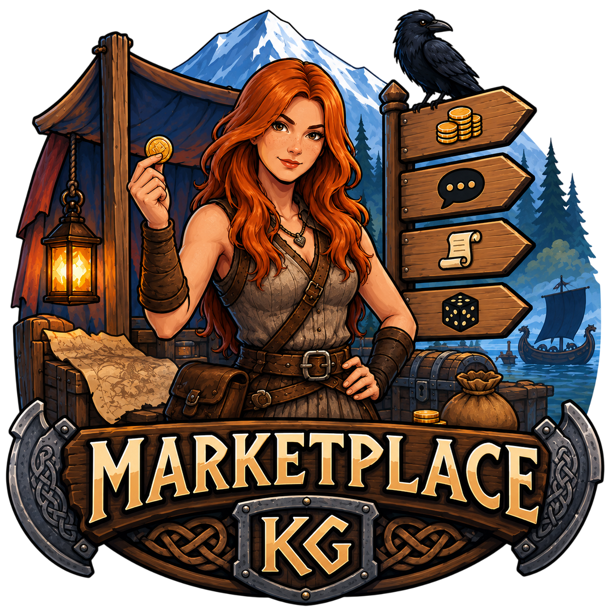
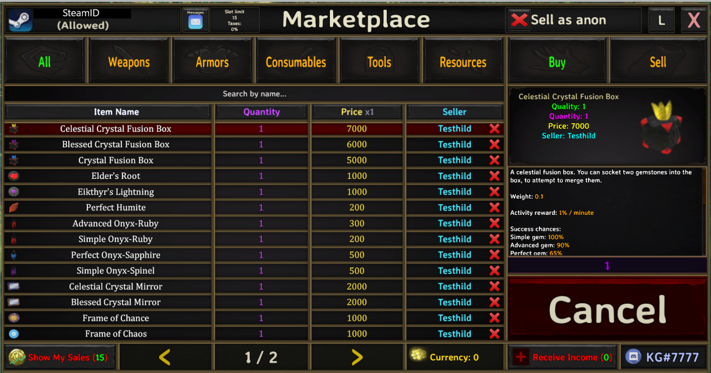
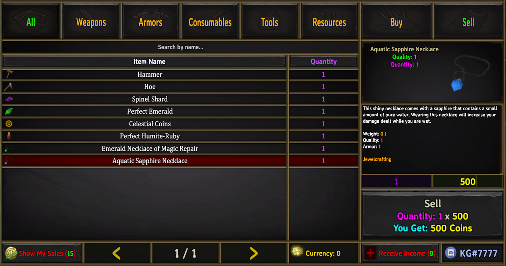

# Marketplace and Server NPCs (Revamped)

**Marketplace and Server NPCs (Revamped)** adds server-configurable NPCs and mechanics to Valheim — a player-to-player marketplace, shops, quests, dialogue trees, zones, banking, gambling, transmog, and more. Admins configure everything themselves by editing text files, and changes apply live — no server restart needed, see [Hot reload](setup/hot-reload.md).

This documentation is written for **server admins** — nearly every page is about config files only an admin edits. A couple of pages are the exception and matter to any player: [Client config](setup/client-config.md) (each player's own settings — chat, keybinds, UI) and a few entries on [Console commands](setup/console-commands.md) that don't need admin access. Every page leads with practical examples rather than bare reference tables — most open with a working example you can copy and adapt.

Install the mod with [Gale](https://hexium.gg/mod-manager) via [Hexium](https://valheim.hexium.gg/mods/KG/Marketplace_And_Server_NPCs_Revamped), or by hand — see [Installation](setup/installation.md) for every option, [File structure](setup/file-structure.md) for what gets created on first run, and [Server config](setup/server-config.md)/[Client config](setup/client-config.md) for the settings worth a look right away (admin access, currency, taxes, and the rest).

There is no in-game editor: quests, dialogues, zones, NPCs, and everything else below are built by editing plain text config files that the mod picks up live (see [Hot reload](setup/hot-reload.md) for exactly what that covers) — see [Content creation](concepts/content-creation.md) for how it all fits together, including [config file syntax](concepts/config-syntax.md), [profiles](concepts/profiles.md), [conditions](concepts/conditions.md), [commands](concepts/commands.md), [prefabs and text markup](concepts/prefabs-and-assets.md), [custom assets](assets/custom-assets.md), and [scheduling a config to a time window](concepts/time-windows.md).

## Key features

### Core: NPCs, quests, dialogue & factions

- **[NPC system](npc/npc-system.md)** — placeable NPCs: type, appearance, dialogue, map pin, patrol. Placed with the [Marketplace Hammer](npc/marketplace-hammer.md) build tool. Reusable setups: [Saved NPCs](configs/saved-npcs.md). Idle chatter: [Random NPC Speech](configs/random-npc-speech.md).
- **[Quests](configs/quests.md)** — the full quest system, 10 quest types. Assigning quests to an NPC: [Quest Profiles](configs/quest-profiles.md). Scripting what happens on accept/complete/cancel: [Quest Events](configs/quest-events.md). Walkthroughs: [Your first quest](guides/first-quest.md), [Quest chains](guides/quest-chain.md).
- **[Dialogues](configs/dialogues.md)** — branching NPC conversations, with conditions and scripted actions. Attaching extra data to something a dialogue spawns: [Custom Spawn Data](configs/custom-spawn-data.md). Walkthroughs: [A branching dialogue tree](guides/dialogue-tree.md), [Dialogue patterns](guides/dialogue-patterns.md), [Tracking player state](guides/tracking-player-state.md).
- **[Factions](configs/factions.md)** — player factions with shared perks, restricted items, and friendly monsters, joined and checked through the same [Dialogues](configs/dialogues.md)/[Quests](configs/quests.md) commands and conditions above.

### Economy: shops, currency & rewards

- **[Marketplace](setup/server-config.md)** — the player-to-player auction house. Works immediately with no setup; tax and listing-limit settings live in the server config.
- **[Traders](configs/traders.md)** — an NPC shop with a fixed buy/sell list.
- **[Bankers](configs/bankers.md)** — deposit and withdraw currency, with periodic interest.
- **[Gamblers](configs/gamblers.md)** — spend an item, get a randomized reward.
- **[Buffers](configs/buffers.md)** — an Enchanter NPC that sells temporary buffs. Choosing which buffs an NPC offers: [Buffer Profiles](configs/buffer-profiles.md).
- **[Transmogrification](configs/transmogrification.md)** — change how an item looks without changing its stats.

Walkthrough tying these together: [Shops, currency, and taxes](guides/shop-and-economy.md).

### World: zones, travel & server info

- **[Server Info](configs/server-infos.md)** — rules and announcement boards.
- **[Teleporters](configs/teleporters.md)** — a fast-travel hub NPC.
- **[Territories](configs/territories.md)** — named zones with behavior flags: PvP rules, healing auras, biome overrides, and more.

Walkthrough: [Setting up a territory](guides/territory-setup.md).

### Server utilities & extras

- **[Player Tags](configs/player-tags.md)** — name-tag prefixes per player, like `[Admin]` or `[VIP]`.
- **[Synced Localizer](configs/synced-localizer.md)** — server-wide text overrides, sent to every player automatically.
- **[Console commands](setup/console-commands.md)** — admin and debug commands.
- **[Discord Webhooks](configs/discord-webhooks.md)** — posts marketplace sales, gambler wins, and quest completions to a Discord channel.

#### UI panels

- **[Mail](setup/server-config.md#mail)** — send items and messages between players. Works immediately; mailbox recipe and timing live in the server config.
- **[Feedback](setup/server-config.md#feedback)** — a feedback form that posts to a Discord webhook. Works immediately; the webhook link lives in the server config.
- **[Chat](setup/client-config.md#kg-chat)** — a replacement chat window. Client-side settings only.
- **[Distanced UI](configs/distanced-ui.md)** — open shop/quest/mail menus without a nearby NPC.
- **[Leaderboard Achievements](configs/leaderboard-achievements.md)** — server-wide leaderboards and achievements.

### How to read a config page

Most config pages above follow the same shape:

1. A working example, explained piece by piece.
2. A table of every option/value you can use.
3. Anything that behaves in a way you might not expect.
4. Links to related pages.

Every config example is written with generous spacing (`Key: Value | Key2: Value2` rather than `Key:Value|Key2:Value2`) — spaces around punctuation are always safe to use in your own files and make them much easier to read later.

## Tooling

- [VS Code extensions](tooling/vscode-extension.md) — editor extensions, starting with syntax highlighting.
- [Coming soon](tooling/coming-soon.md) — AI-assisted config generation and a visual config editor, planned but not built yet.

## For mod developers

- [Integrating with this mod](api/modder-api.md) — what other mods can read and change.

## Reference

- [Localization keys](reference/localization-keys.md)
- [Changelog](reference/changelog.md)
- [Migrations](reference/migrations.md) — what to do when updating across a version with a breaking change
- [Known gaps](reference/known-gaps.md) — current-version quirks and things that look like they should work but do not

## What it looks like

| | |
|---|---|
|  |  |

More screenshots for a specific module live on that module's own page — see **Key features** above.

Prefer watching over reading? See [Video guides](guides/video-guides.md) for community walkthroughs.

Want to ask an AI about this mod instead of reading? Every page has a "Use with AI" bar at the top — copy that page as Markdown, open it directly in ChatGPT/Perplexity/Grok, or paste it into Claude/Gemini. To hand an AI the whole documentation at once, grab [`/llms-full.txt`](/llms-full.txt) (one file, everything); for just a linked index, see [`/llms.txt`](/llms.txt).

## Support the author

If this documentation or the mod itself saved you time, consider supporting KG, the mod's author:

- **Discord:** [discord.gg/QgvSmhkbmy](https://discord.gg/QgvSmhkbmy) — questions, comments, community help
- **Donate:** PayPal — `war3spells@gmail.com`
