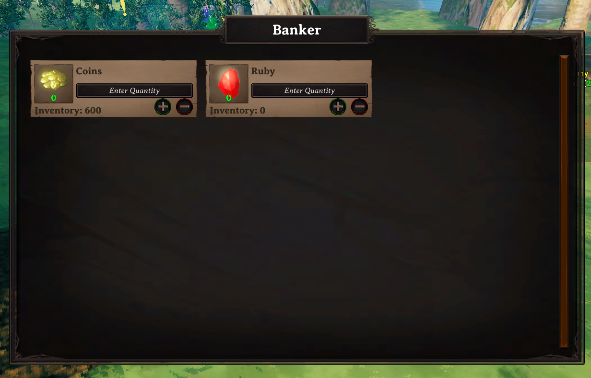
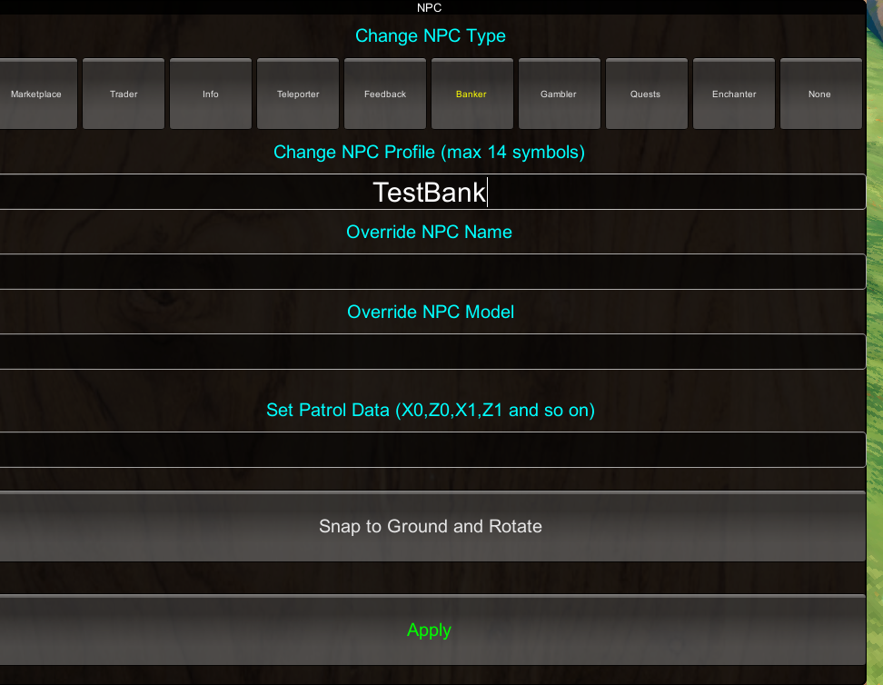

# Bankers

**Folder:** `Configs/Bankers/` (any file name, `.cfg`)

Controls which items a Banker NPC will accept for deposit and withdrawal. Once you have written a profile here, put its name in a `Banker`-type NPC's **Profile** field to make it live — see [Core identity settings](../npc/npc-system.md#core-identity-settings).



## Example

`Configs/Bankers/main_bank.cfg`:

```
[main_bank]
Coins
Ruby
Amber
```

One item name per line — this list only decides **which item types** can be banked at all; how much a player has deposited is tracked automatically and does not live in this file.

## Assigning it to an NPC

Put the profile name (`main_bank` above) into a `Banker`-type NPC's **Profile** field — see [Core identity settings](../npc/npc-system.md#core-identity-settings):



## Accessing a bank without a nearby NPC

A Banker profile can also be reached remotely, without a Banker NPC in range at all, by listing it under `BankerProfiles` in [Distanced UI](distanced-ui.md).

## Interest

Interest on deposits is not set here — it is a server-wide setting. See [Server config](../setup/server-config.md) for `BankerIncomeTime`, `BankerIncomeMultiplier`, `BankerVIPIncomeMultiplier`, and `BankerInterestItems`.

## Related

- [Profiles](../concepts/profiles.md) — how a banker profile name groups entries across files.
- [Server config](../setup/server-config.md) — interest rate settings.
- [Distanced UI](distanced-ui.md) — remote access without a nearby NPC.
- [Shop and economy guide](../guides/shop-and-economy.md).
