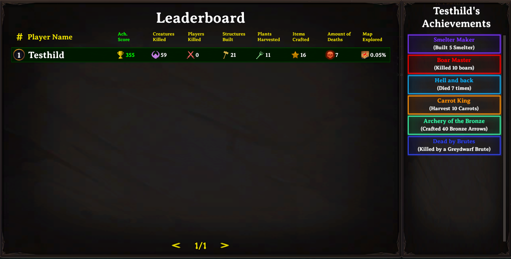

# Leaderboard Achievements

**Folder:** `Configs/LeaderboardAchievements/` (any file name, `.cfg`)

Defines achievements tracked on the server leaderboard — kills, crafting, building, deaths, exploration, PvP kills. Requires `UseLeaderboard = true` in the [server config](../setup/server-config.md); otherwise the leaderboard does not run at all.



## Example

`Configs/LeaderboardAchievements/achievements.cfg`:

```
[wolf_hunter]
MonstersKilled
Wolf Hunter
Kill 50 wolves
Wolf, 50
200, 200, 200
100

[explorer]
Explored
World Explorer
Explore 75% of the map
75
100, 200, 255
250
```

| Line | Meaning |
|---|---|
| header | The achievement's unique ID. |
| 1 | Trigger type — see the table below. |
| 2 | Display name. |
| 3 | Description. |
| 4 | The target — `item, amount` for most types, or just `amount` for `Explored`/`Died`/`PlayersKilled`. |
| 5 | Badge color, `r, g, b`. |
| 6 | Score — used for sorting achievements and toward `HasAchievementScore`. |

Unlike most `[Section]` headers in this mod, an achievement ID is **case-sensitive and keeps internal spaces exactly as written** — `[wolf_hunter]` and `[Wolf_Hunter]` are two different achievements, not the same one. Keep this in mind when referencing an ID from `HasAchievement` in [Conditions](../concepts/conditions.md) — it must match the header exactly, including case.

## Trigger types

| Trigger | Needs an item/creature name? | Tracks |
|---|---|---|
| `MonstersKilled` | yes | Kills of a specific creature. |
| `ItemsCrafted` | yes | Crafts of a specific item. |
| `StructuresBuilt` | yes | Builds of a specific piece. |
| `KilledBy` | yes | Deaths to a specific creature. |
| `Harvested` | yes | Harvests of a specific resource. |
| `Explored` | no | Total map exploration percentage. |
| `Died` | no | Total death count. |
| `PlayersKilled` | no | Total PvP kills. |

## Related

- [Server config](../setup/server-config.md) — `UseLeaderboard`.
