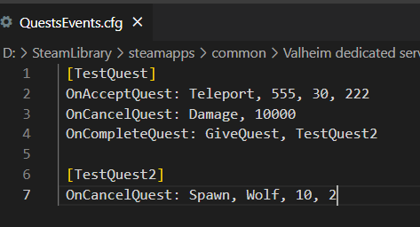

# Quest Events

**Folder:** `Configs/QuestEvents/` (any file name, `.cfg`)

Quest Events let you attach [commands](../concepts/commands.md) and [conditions](../concepts/conditions.md) to a quest's lifecycle — accepting it, completing it, cancelling it, timing out, or the player dying while it is active. This is how a quest can do more than just hand out a reward — spawn a boss on accept, remove borrowed gear if the player dies, teleport them somewhere on completion.



## Example

`Configs/QuestEvents/boss_hunt.cfg`:

```
[boss_hunt]
OnAcceptQuest: GiveItem, SwordIron, 1, 3
OnAcceptQuest: GiveItem, HealthPotion, 3, 1
OnCompleteQuest: AddPlayerKey, boss_01_defeated
OnCompleteQuest: Teleport, 0, 30, 0
OnCompleteQuest: GuildAddLevel, 5
OnDeath: RemoveItem, SwordIron, 1
```

This lends the player a sword and potions when they accept a "boss hunt" quest, takes the borrowed sword back if they die mid-fight, and on success marks a permanent flag, teleports them home, and gives their guild a level.

## Format

```
[quest_id]
EventName: entry1 | entry2 | ...
```

The `[quest_id]` header must match a quest defined in [Quests](quests.md) exactly — this is how the event attaches to that specific quest. You can add several `EventName:` lines under the same header; they all apply.

## Available events

| Event | Fires when |
|---|---|
| `OnAcceptQuest` | The player accepts the quest. |
| `OnCancelQuest` | The quest is cancelled or removed. |
| `OnCompleteQuest` | The quest is turned in / completed. |
| `OnQuestTimeout` | The quest's time limit runs out before it is finished (see [Quests](quests.md#cooldown-and-time-limit)). |
| `OnDeath` | The player dies while the quest is active. |

## Writing entries

Each entry after the event name is either a plain command, or an explicit condition — separate several with `|`:

```
OnCompleteQuest: HasAchievement, dragonslayer | GiveItem, Coins, 500
```

This only gives the bonus 500 Coins if the player already has the `dragonslayer` achievement — conditions gate whatever commands follow them on the same line.

You do not need to write `Command:` in front of a plain action — just the action name works:

```
OnAcceptQuest: Spawn, GoblinKing, 1, 3
```

## Practical patterns

Clean up temporary gear on failure:

`Configs/QuestEvents/boss_hunt.cfg`:

```
[boss_hunt]
OnAcceptQuest: GiveItem, SwordIron, 1, 3
OnCancelQuest: RemoveItem, SwordIron, 1
OnQuestTimeout: RemoveItem, SwordIron, 1
```

Announce a completion in Discord:

`Configs/QuestEvents/dragon_slayer.cfg`:

```
[dragon_slayer]
OnCompleteQuest: SendWebhook, discord.com/api/webhooks/xxxx, %playername% slew the dragon!
```

Teleport to safety on timeout:

`Configs/QuestEvents/timed_trial.cfg`:

```
[timed_trial]
OnQuestTimeout: Teleport, 0, 30, 0
```

## Related

- [Quests](quests.md), [Commands](../concepts/commands.md), [Conditions](../concepts/conditions.md).
