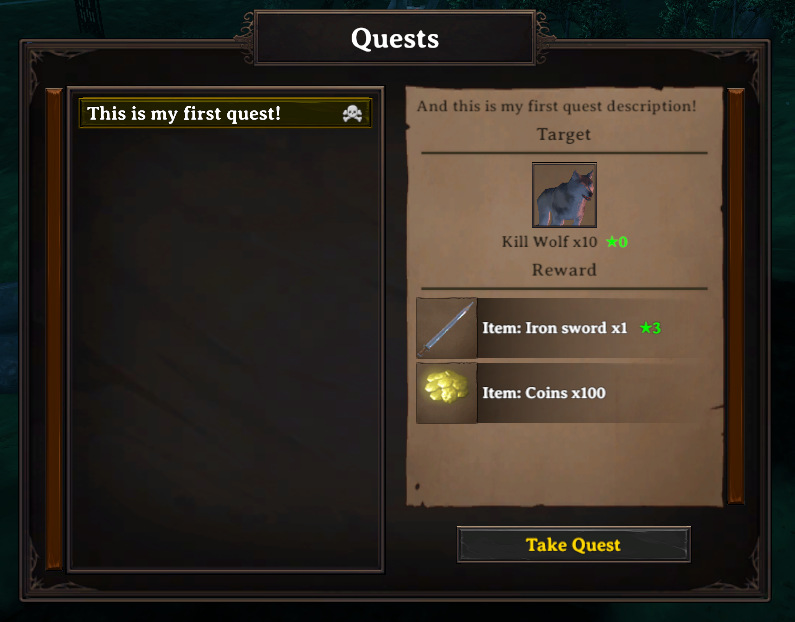
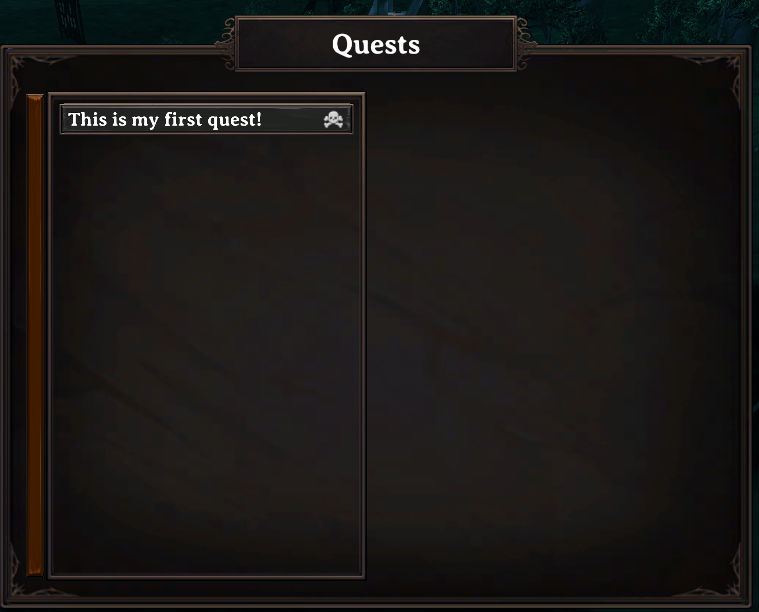
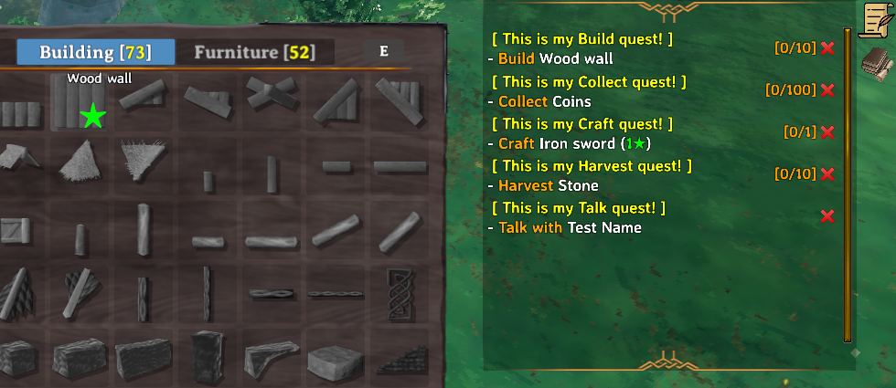
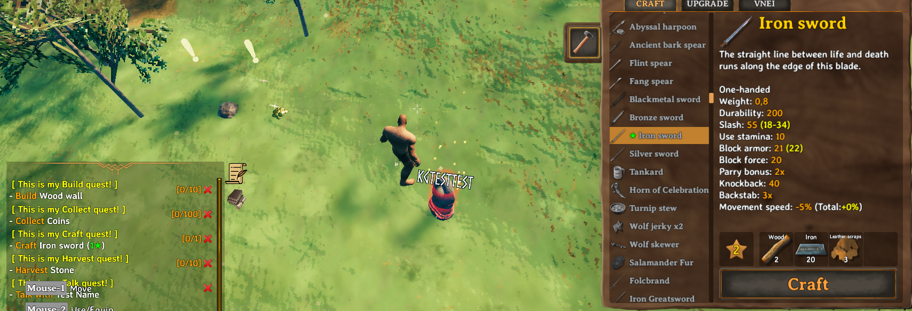
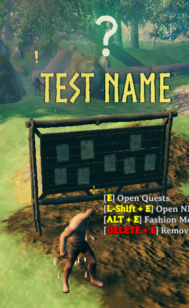
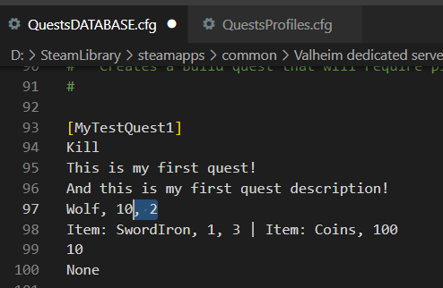
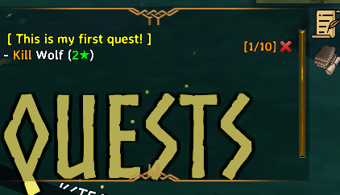
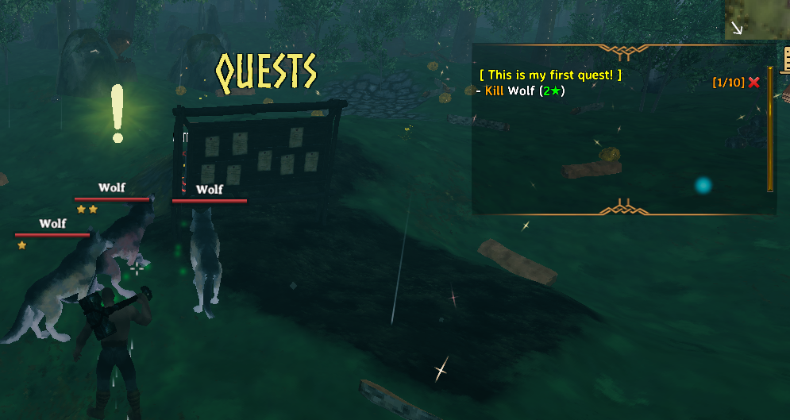

# Quests

**Folder:** `Configs/Quests/` (any file name, `.cfg`)

This is where you define quests themselves — what to do, what it gives, how long it lasts. A quest here is not tied to any particular NPC yet; you hand it out to NPCs separately, through [Quest Profiles](quest-profiles.md).

At a glance, a quest database file (`Configs/Quests/starter.cfg`) with a few simple quests:

```
[greet_elder]
Talk
A Warm Welcome
Say hello to the village elder.
"Village Elder"
Item: Coins, 10
0

[wolf_pelts]
Kill
Wolf Culling
The village needs wolf pelts. Bring me 5.
Wolf, 5, 1
Item: Coins, 50 | Skill_EXP: Bows, 20
0

[gather_wood]
Collect
Timber Run
Bring me 20 wood.
Wood, 20
Item: Coins, 30
0
```

...and a [Quest Profile](quest-profiles.md) (`Configs/QuestProfiles/starter.cfg`) handing all three to one NPC:

```
[village_elder]
greet_elder, wolf_pelts, gather_wood
```

And what accepting a quest looks like from the NPC's side and the player's own journal:

| NPC's quest offer | Player's quest journal |
|---|---|
|  |  |

## A complete example, explained line by line

`Configs/Quests/wolf_pelts.cfg`:

```
[wolf_pelts]
Kill
Wolf Culling
The village needs wolf pelts. Bring me 5.
Wolf, 5, 1
Item: Coins, 50 | Skill_EXP: Bows, 20
0
```

| Line | Content | Meaning |
|---|---|---|
| header | `[wolf_pelts]` | The quest's unique ID — this is what you reference from a Quest Profile, from another quest's chain condition, or from a Quest Event. |
| 1 | `Kill` | The quest type — what kind of objective this is. See [Quest types](#quest-types) below. |
| 2 | `Wolf Culling` | The quest's title, shown in the quest journal. |
| 3 | `The village needs...` | The description text. |
| 4 | `Wolf, 5, 1` | The target: kill Wolves, 5 of them, minimum star level 1 — see [the note below](#the-kill-level-field) for exactly how this field works. |
| 5 | `Item: Coins, 50 \| Skill_EXP: Bows, 20` | Rewards: 50 Coins and 20 Bow skill experience. |
| 6 | `0` | Cooldown in seconds — `0` means the quest is repeatable immediately after completion. |
| 7 (not shown above, optional) | unlock requirements | Left empty here — no requirements, so this quest is available right away. See [Conditions](../concepts/conditions.md). |

If you leave off the requirements line entirely, that is fine — it defaults to "no requirements."

## Quest types

There are 10 quest types. Pick the one that matches the action you want the player to perform:

| Type | What the player does | Notes |
|---|---|---|
| `Kill` | Kill a creature | Most common type — pairs well with `Harvest` for varied daily quests. |
| `Collect` | Hand in an item from their inventory | The items are taken away when the quest is turned in — good for "get rid of your surplus" quests, bad for anything rare or hard to get. |
| `Harvest` | Gather from a pickable resource (berry bush, ore vein, etc.) | Different from `Collect` — this is about the *action* of harvesting, not just owning the item. |
| `Craft` | Craft an item at a specific quality | Good for nudging players toward crafting/upgrading. |
| `Talk` | Talk to a specific NPC | Completes automatically as soon as the conversation happens — great for tutorial/intro quests in a chain. |
| `Build` | Build a specific structure | Resources used are not refunded if the structure is later destroyed — use sparingly. |
| `Move` | Reach a specific location | Good for guiding players to explore somewhere. |
| `KillAndCollect` | Kill a creature and also collect a matching drop | A combined objective — see the [example below](#example-killandcollect). |
| `Use` | Use a specific item or action | For item-based interactions. |
| `Activate` | Interact with a specific object | For activatable world objects. |

Most quest types show a marker on their target in the world, and can be toggled off per-player in [Client config](../setup/client-config.md) (`Show Quest Mark`):

| `Build` marker | `Harvest`/`Collect` marker | `Talk` marker |
|---|---|---|
|  |  |  |

### The target line, by type

The target line's format depends on the quest type above it. General shape is `item/creature, amount, [level]`, and you can list several targets on one line separated by `|`:

```
Wolf, 5, 1 | Boar, 3, 1
```
(kill 5 wolves and 3 boars, each at least 1-star, all counting toward the same quest)

- **`Kill`**: `creature, amount, level` — level is the minimum star rating the creature must have, `0` (or omit it) for no requirement at all.
- **`Collect`** / **`Craft`**: `item, amount, level` — level is item quality.
- **`Harvest`** / **`Build`**: `object, amount` — no level field.
- **`Talk`**: the full NPC name, in quotes if it has a space — e.g. `"Village Elder"`.
- **`Move`**: `X, Z, radius, "Location Name", showOnMap` — `showOnMap` is `true`/`false`.
- **`Use`**: `item, amount, extra info` — the third field's exact meaning depends on what you are hooking it up to.
- **`Activate`**: `object, extra info, extra info, ...` — any fields after the first are passed along as-is.

#### Example: `KillAndCollect`

This type needs more detail per target — creature, kill count, level, then a label for the item you want collected, then any extra fields:

```
GoblinRaider, 5, 2, ear, none, none, none, none, none
```

Kill 5 at-least-1-star Goblin Raiders and collect 5 "ear" trophies (a quest-only item created just for this quest, not a real item you can get any other way). **The level field here works differently from plain `Kill`** — see [The `Kill` level field](#the-kill-level-field) for the exact difference before you rely on a specific star count.

## Reward types

You can combine several reward types on one line with `|`:

```
Item: Coins, 200 | Item: Ruby, 1 | Skill_EXP: Swords, 100
```

| Reward type | Format | Notes |
|---|---|---|
| `Item` | `item, amount, [level]` | A normal item reward. |
| `RandomItem` | `pool name` | Picks from a random-item pool you have set up elsewhere. |
| `Skill` / `Skill_EXP` | `skill, amount` | Skill points / raw experience. |
| `Pet` | `creature, amount, level` | Gives a tamed pet. |
| `EpicMMO_EXP` / `Cozyheim_EXP` / `Battlepass_EXP` / `RustyClasses_EXP` | `amount` | Experience for the matching integration, if that mod is installed. |
| `GuildAddLevel` | `amount` | Adds levels to the player's guild. |
| `SetCustomValue` / `AddCustomValue` | `key, amount` | Sets/adds to a [custom value](../concepts/prefabs-and-assets.md#custom-values) — good for reputation-style systems. |

## Cooldown and time limit

```
3600, 600
```

First number is the cooldown in seconds before the quest can be taken again after completion (`0` = always available). Second, optional number is a time limit — how long the player has after accepting before it auto-fails (`0` or omitted = no time limit).

## Unlock requirements

The last line uses the [condition language](../concepts/conditions.md) — this is how you build quest chains, level gates, or item-cost quests:

```
QuestFinished, meet_the_elder | SkillMore, Swords, 5
```

Only available once the player has finished `meet_the_elder` **and** has at least skill level 5 in Swords.

## Special quest tags

Add one of these to the header, after `=`, for special behavior:

```
[final_boss = Autocomplete]
```

| Tag | Effect |
|---|---|
| `Autocomplete` | Completes automatically the moment the objective is met — no need to talk to an NPC to turn it in. Common for a chain's final boss fight. |
| `HiddenAnyCondition` | Stays hidden from the quest list unless at least one requirement currently passes. |
| `HiddenOtherQuestCondition` | Stays fully hidden until its chain prerequisite is met — good for not spoiling upcoming quests before they unlock. |

Without either tag, a quest whose requirements are not yet met still shows up in the NPC's list — the player just cannot take it yet. Use one of the two tags above only when you specifically want to keep a quest a surprise.

## Cooldown and quest-list visibility

A quest that is on cooldown still shows in the NPC's list (with a countdown) as long as the remaining cooldown is under 5000 in-game days. Past that, it disappears from the list entirely once completed — this is the trick behind "one-time" quests: set the cooldown to something like `10000` and the quest vanishes for that player for good after their first completion, instead of reappearing once the cooldown would normally expire.

## The `Kill` level field

The level field on a `Kill` target is the minimum star rating the creature must have — write `2` and only 2-star-and-above creatures count, write `0` or leave it off entirely and any star rating counts. What you write is exactly what shows up in-game, both in the quest journal and on the target requirement — there is no hidden offset to account for.

For example, changing a target line from `Wolf, 10` to `Wolf, 10, 2`:



...changes the in-game requirement so only 2-star-and-above wolves count, shown by the marker over qualifying wolves:

| Target updated | Marker on a qualifying wolf |
|---|---|
|  |  |

**`KillAndCollect` works differently — its level field is one *higher* than the effective star minimum.** Writing `2` there requires only a 1-star-and-above creature, not 2-star; writing `1` requires no star at all. If you want a specific minimum star count on a `KillAndCollect` target, write that number plus one. This asymmetry is easy to get wrong, so double-check with a test kill if the exact star requirement matters for that quest.

## A full worked example

`Configs/Quests/chain.cfg`:

```
[wolf_pelts]
Kill
Wolf Culling
The village needs wolf pelts. Bring me 5.
Wolf, 5, 1
Item: Coins, 50 | Skill_EXP: Bows, 20
0

[timber_run = HiddenOtherQuestCondition]
Collect
Timber Run
Bring me wood and craft me a good axe.
Wood, 20 | AxeFlint, 1, 2
Item: Coins, 100 | Skill_EXP: WoodCutting, 50
3600, 600
QuestFinished, wolf_pelts
```

Here, `timber_run` stays hidden until `wolf_pelts` is completed, and once accepted the player has 10 minutes (600 seconds) to finish it before it auto-fails; it can then be repeated once per hour (3600 seconds).

## Related

- [Quest Profiles](quest-profiles.md) — assigning quests to an NPC.
- [Quest Events](quest-events.md) — scripted reactions on accept/complete/cancel/timeout/death.
- [Conditions](../concepts/conditions.md).
- [First quest guide](../guides/first-quest.md), [Quest chain guide](../guides/quest-chain.md).
