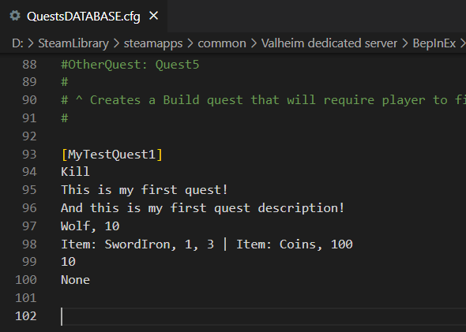
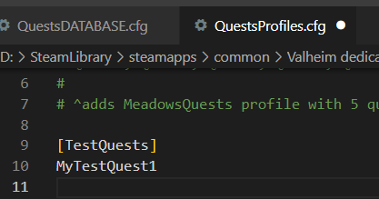
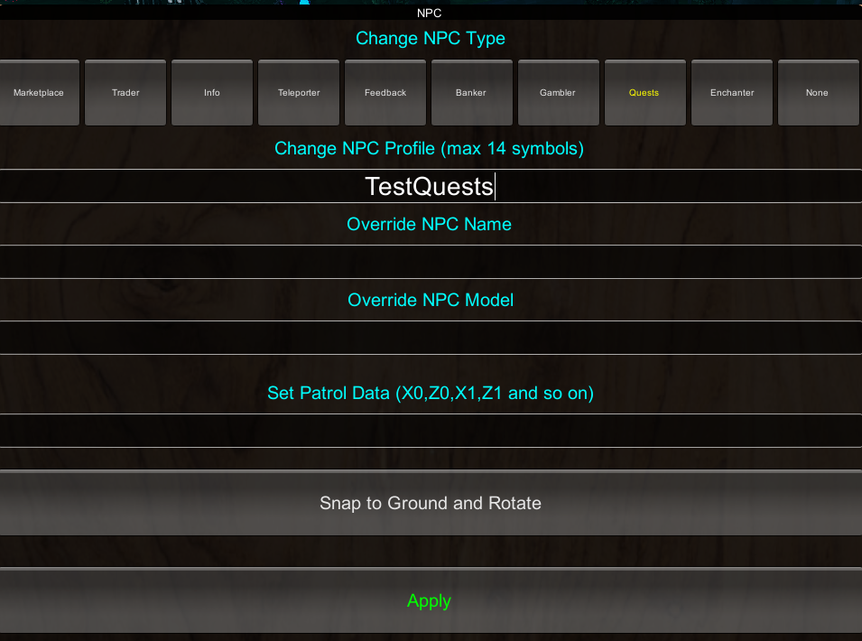
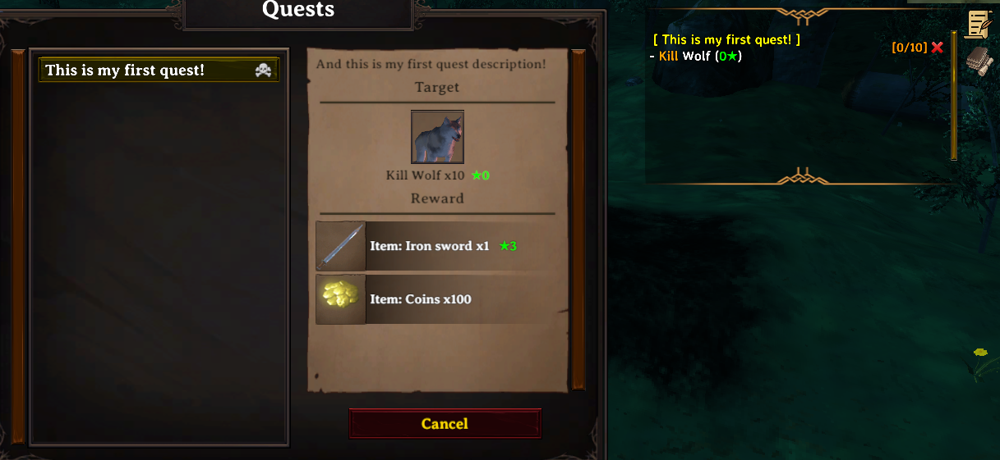
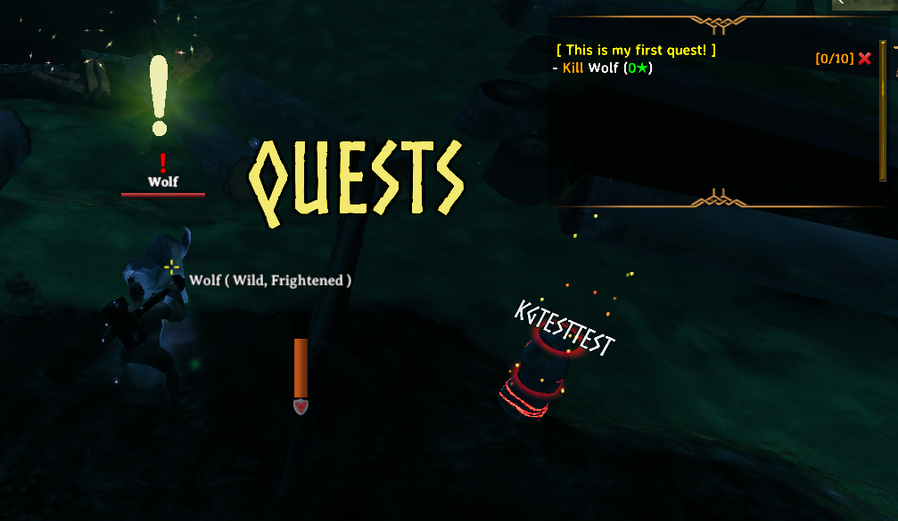
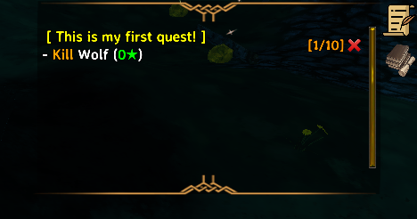
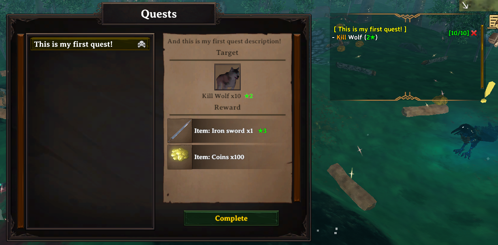
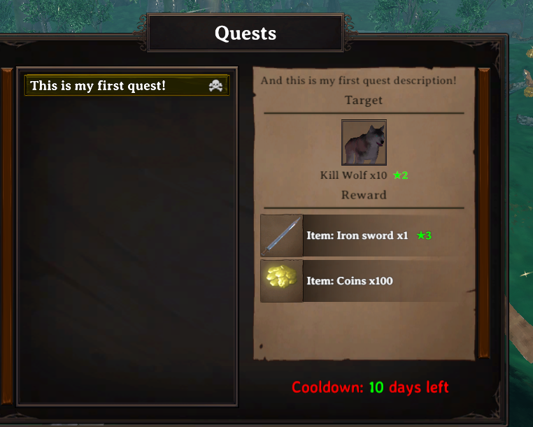

# Guide: your first quest

A complete, start-to-finish example: writing a quest, assigning it to an NPC, and placing that NPC in the world. This is the fastest way to see the whole system working together.

## Step 1: Write the quest

Create a file, for example `Configs/Quests/starter.cfg`:

```
[wolf_pelts]
Kill
Wolf Culling
The village needs wolf pelts. Bring me 5.
Wolf, 5, 1
Item: Coins, 50 | Skill_EXP: Bows, 20
0
```



What this says:
- Quest type `Kill`, targeting `Wolf`, 5 of them, requiring at least star level `1` — see the level note on [Quests](../configs/quests.md#the-kill-level-field).
- Reward: 50 Coins and 20 Bow skill experience.
- Cooldown `0` — the quest can be repeated right away.
- No unlock requirement — leaving the last line empty means it is available immediately.

Full field-by-field reference: [Quests](../configs/quests.md).

## Step 2: Give it to an NPC

Quests are not attached directly to an NPC — you assign them through a profile. Create `Configs/QuestProfiles/starter.cfg`:

```
[village_elder]
wolf_pelts
```



Any NPC set to profile `village_elder` will now offer this quest. Full reference: [Quest Profiles](../configs/quest-profiles.md).

## Step 3: Place the NPC

With admin access, open the build menu and select the Marketplace Hammer. Place an NPC, then in its settings:

- **Type**: `Quests`
- **Profile**: `village_elder`
- Optionally set a **Name Override**, a **Dialogue**, and appearance settings.



Full reference: [NPC system](../npc/npc-system.md), [Marketplace Hammer](../npc/marketplace-hammer.md).

## Step 4: Test it

Both files apply automatically within a moment of saving — no restart needed (see [Hot reload](../setup/hot-reload.md)). Talk to the NPC, accept the quest, kill 5 wolves, and turn it in.

### What this looks like in-game

Once accepted, the target creature gets a marker so the player can find it:





Progress updates automatically as kills come in — the journal tracks how many of the required kills are done so far:



Turning the quest in at the NPC hands out the reward:





### If the quest does not appear

- Check the server console for a parsing error — most mistakes are logged there, in red, with the file and line number.
- Confirm the quest ID in `QuestProfiles` matches the quest's own `[header]` exactly — spacing and capitalization do not matter, but typos do.
- Confirm the NPC's Profile setting matches the `[village_elder]` header exactly.
- If you edited an existing file and nothing changed, make sure you saved it and are editing the copy the running server actually uses.

## Next steps

- [Quest chains](quest-chain.md) — link several quests into a story sequence.
- [Dialogue trees](dialogue-tree.md) — give the NPC a full branching conversation instead of just a quest list.
