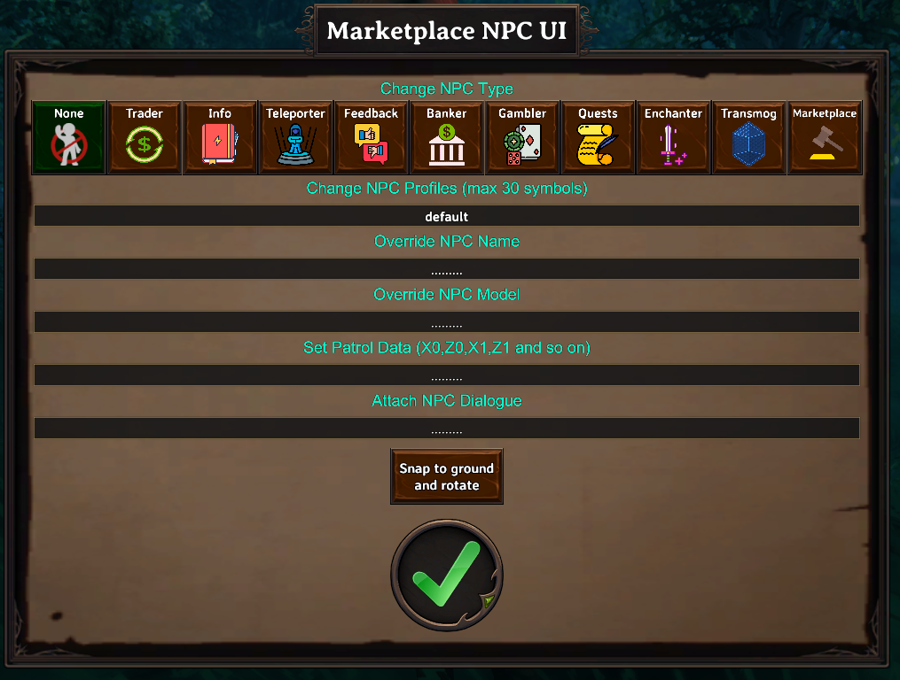
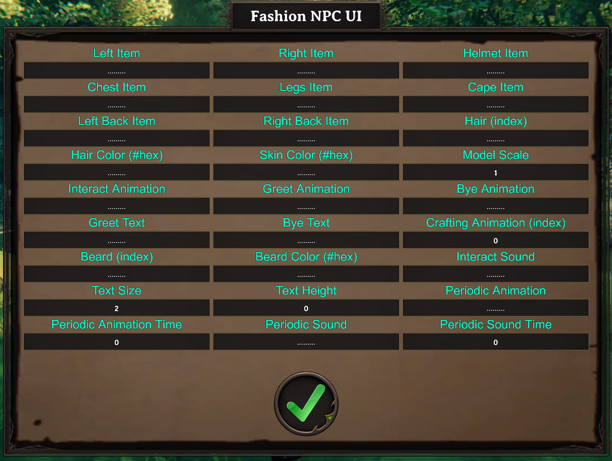

# NPC system

NPCs are placed in the world using [Marketplace Hammer](marketplace-hammer.md), a build-mode tool. Once placed, you configure an NPC through its own settings panel — no config file needed for the NPC itself (though you can export one for reuse, see [Saved NPCs](../configs/saved-npcs.md)).

## NPC types

An NPC's **Type** decides what it does, and which profile folder its **Profile** field looks into:

| Type | Profile comes from | See |
|---|---|---|
| `None` | — | No mechanic — a decorative or dialogue-only NPC. |
| `Trader` | Traders | [Traders](../configs/traders.md) |
| `Info` | Server Info | [Server Info](../configs/server-infos.md) |
| `Teleporter` | Teleporters | [Teleporters](../configs/teleporters.md) |
| `Feedback` | — | No config folder — posts player feedback to the Feedback Discord webhook. |
| `Banker` | Bankers | [Bankers](../configs/bankers.md) |
| `Gambler` | Gamblers | [Gamblers](../configs/gamblers.md) |
| `Quests` | Quest Profiles | [Quest Profiles](../configs/quest-profiles.md) |
| `Buffer` | Buffer Profiles | [Buffer Profiles](../configs/buffer-profiles.md) |
| `Transmog` | Transmogrifications | [Transmogrification](../configs/transmogrification.md) |
| `Marketplace` | — | The player-to-player auction NPC — no setup needed, works immediately. |
| `Mail` | — | Opens the mail menu. |

Every NPC also has an optional **Dialogue** field, separate from its Type — any NPC, including `None`, can have a full conversation attached (see [Dialogues](../configs/dialogues.md)).

## Core identity settings

| Setting | What it does |
|---|---|
| Type | One of the types above. |
| Name Override | A custom display name. |
| Profile | Which profile this NPC uses, from the folder matching its Type. |
| Model/Prefab Override | Swaps the NPC's appearance for a different creature/character model — supports the animation-swap trick and randomized pools, see [Prefabs and text markup](../concepts/prefabs-and-assets.md). |
| Dialogue | A dialogue ID from [Dialogues](../configs/dialogues.md). |
| Pin Icon | The map pin shown for this NPC, if any. |

## Appearance settings

Set through the NPC's fashion panel: left/right hand items, helmet, chest, legs, cape, hair, hair color, beard, beard color, skin color, model scale, hidden-item toggles, greeting/farewell text and animations, crafting animation, interact sound and animation, text size/height, and periodic idle animation/sound.

Most appearance fields accept a **space-separated list** of options — one is picked at random each time the NPC spawns, so a single NPC setup can produce visual variety across several placements. Greeting/farewell text also supports [dynamic placeholders](../concepts/prefabs-and-assets.md#dynamic-text-keyword) like `%playername%`.

Periodic animation and periodic sound make the NPC occasionally play an idle animation or sound on their own — separate from [Random NPC Speech](../configs/random-npc-speech.md), which handles idle *text* barks instead.

## Patrol routes

Give an NPC a patrol route two ways:

- **Record it in-game**: while holding Marketplace Hammer, drop waypoints as you walk the route, then confirm — the route is copied for you to paste into a `SetNPCPatrol` command (see [Commands](../concepts/commands.md)).
- **Script it**: use the `SetNPCPatrol` command from a dialogue or quest event to set or change a patrol route on the fly.

## Related

- [Marketplace Hammer](marketplace-hammer.md) — the placement tool.
- [Saved NPCs](../configs/saved-npcs.md) — exporting an NPC setup as a reusable template.
- [Random NPC Speech](../configs/random-npc-speech.md) — idle bark text.
