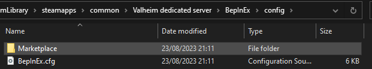
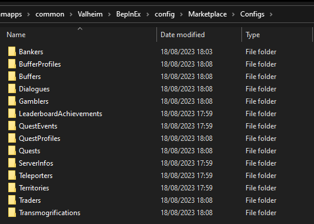
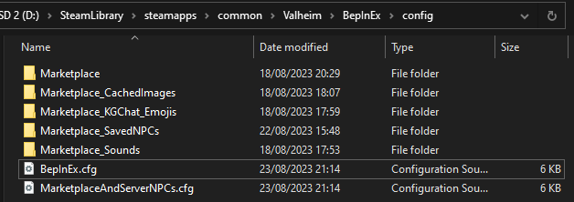

# File structure

A map of every folder and file the mod creates or uses, and what lives where. For how to install the mod itself, see [Installation](installation.md) on the main page.

## First run

Start the server once after installing. On first run, it creates a `Marketplace` folder under `BepInEx/config/` and fills in the subfolders below.

## Server folders

Present on a dedicated server, or on a client hosting a game (or a singleplayer game with local mode turned on — see [Server, client, or singleplayer](installation.md#server-client-or-singleplayer)):



```
BepInEx/config/Marketplace/
├─ Configs/                        ← all content configs, see ../configs/
│  ├─ Quests/  QuestProfiles/  QuestEvents/
│  ├─ Dialogues/  CustomSpawnData/
│  ├─ Territories/
│  ├─ Traders/  Bankers/  Teleporters/  Gamblers/
│  ├─ Buffers/  BufferProfiles/  Transmogrifications/
│  ├─ ServerInfos/  LeaderboardAchievements/
│  ├─ SyncedLocalizer/
│  ├─ Factions.yml
│  └─ RandomNpcSpeech.yml
├─ DiscordWebhooks/
│  └─ DiscordSettings.cfg
├─ DistancedUI/
│  └─ DistancedUI.cfg
├─ PlayerTags/
│  └─ PlayerTags.cfg
├─ SavedData/                      ← the mod's save data (marketplace listings, banks, mail, leaderboard). Only edit this while the server is offline, and be careful — it is easy to corrupt.
└─ MarketPlace.cfg                 ← the main server settings file, see server-config.md
```

`Configs/` on its own contains one subfolder per content type:



## Player-side folders

Live next to `BepInEx/config/Marketplace/`, not inside it — present on every installation, whether or not that computer is also the server:



| Folder | Purpose |
|---|---|
| `Marketplace_Sounds/` | Drop `.mp3` files here to use as sounds — see [Custom assets](../assets/custom-assets.md). |
| `Marketplace_Models/` | Drop `.obj` files here for custom NPC models. |
| `Marketplace_CachedImages/` | Drop `.png` files here for `<image=>` references. |
| `Marketplace_VideoClips/` | Drop video files here for the `PlayVideo` command. |
| `Marketplace_SavedNPCs/` | Hammer-built NPC templates — see [Saved NPCs](../configs/saved-npcs.md). |
| `Marketplace_KGChat_Emojis/` | Custom chat emoji images. |

Once you know where a file lives, the natural next question is what happens after you edit it — most of the time, nothing more than saving is needed; see [Hot reload](hot-reload.md) for exactly what applies live and what needs a manual refresh.

## Related

- [Installation](installation.md) — how to get the mod installed in the first place.
- [Server, client, or singleplayer](installation.md#server-client-or-singleplayer) — which of the folders above exist on which machine.
- [Hot reload](hot-reload.md) — what happens after you edit a file in `Configs/`.
- [Server config](server-config.md), [Client config](client-config.md).
